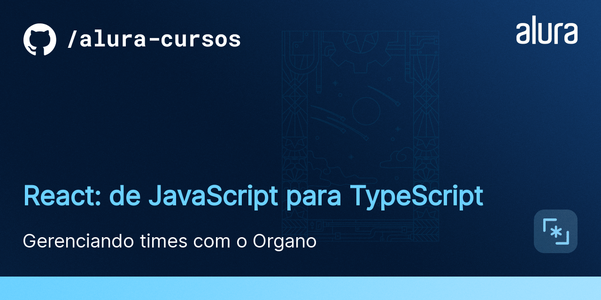

# Organo

O Organo é aplicação desenvolvida no curso <a href="https://cursos.alura.com.br/course/react-desenvolvendo-javascript" target="_blank">React: desenvolvendo com JavaScript</a>. 
Foi pensado e idealizado para ser o primeiro projeto em contato com o React.

## 🔨 Funcionalidades do projeto

Você pode passear <a href="https://cursos.alura.com.br/course/react-desenvolvendo-javascript" target="_blank">no figma</a> para entender a arte conceitual do projeto.

## ✔️ Técnicas e tecnologias utilizadas

Se liga nessa lista de tudo que usaremos nessa formação:

- `React`
- `React Hooks`
- `TypeScript`

E muito mais!